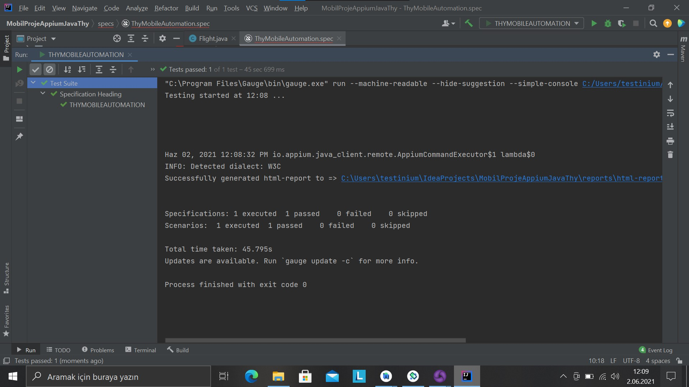
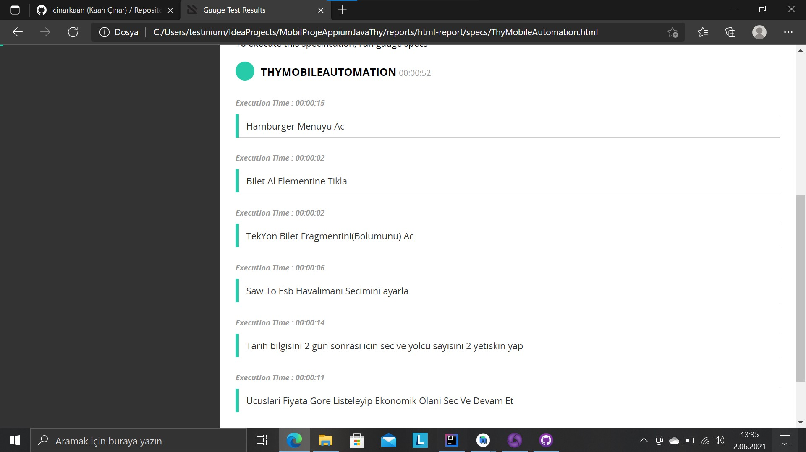
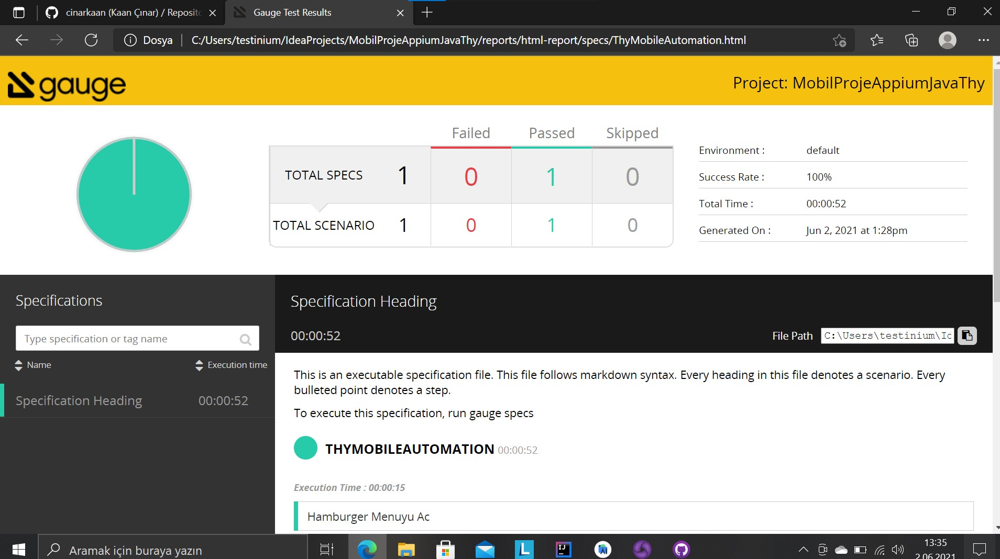

# JavaAppiumMobileThy
 
<h1>Please Read Me</h1>

 Services necessary must be allowed required for run the test app seamless.That's why you must run the app after you install in the android virtual machine for just once. All test scenarios will be run properly after all these process.

<h2>Consequences of all scenarios<h2>
 
 
 
 

 
