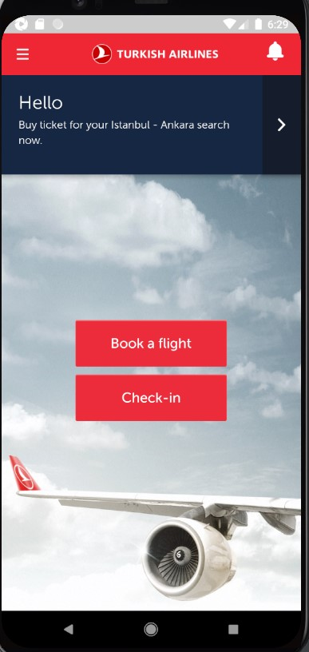

# JavaAppiumMobileThy
 
<h2>LÜTFEN BENİ OKU</h2>

 Uygulama başlatırılırken aşağıdaki ekrandan başlatıp intellij ideadan çalıştırılırsa başarılı olacak.Thy uygulamasi java kodu ile her ayağa kaldırıldığında servis izinleri istiyor bu sebeple uygulamayi yükledikten sonra bir kere çalıştırılıp gerekli izinler verilip veya reddedilip aşağıdaki ekranda yani Main.Activity kısmında bırakılmalıdır.Sonrasında bütün test senaryoları sorunsuz bir şekilde çalışmakta.Teşekkür ederim :)

